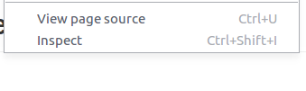
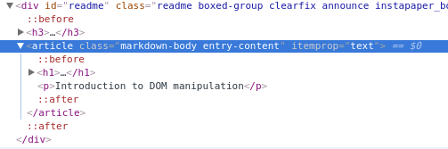

# JavaScript Array & DOM Manipulation Challenge
Introduction to Array & DOM manipulation

## Exercise

1. Clone this repo.

2. Open exercise/index.html in [Live Server](https://marketplace.visualstudio.com/items?itemName=ritwickdey.LiveServer)

3. Open exercise/exercise.js and follow the instructions.


## What is the DOM?

The DOM is the _Document Object Model_, it is the browser's interpretation of the page once it has been [_parsed_](https://developer.mozilla.org/en-US/docs/Glossary/Parse).

## DOM elements

In your browser, if you _right-click_ on a page, you see _inspect element_.



In the image below, `article` is a DOM element.



Any html elements you write will be DOM elements in the browser, for example: `div`, `span`, `input`, `section`, etc etc.

## Accessing DOM elements using Javascript

You can access DOM elements with javascript.

`document.getElementById("myId")` returns the element with ID "myId";
```html
<article id="featured-article">
  Lorem ipsum...
</article>
<script>
  var featuredArticleElement = document.getElementById(#featured-article);
  // <article id="featured-article">...</article>
</script>
```

`document.getElementsByClassName("myClass")` returns an [_array-like object_](http://www.nfriedly.com/techblog/2009/06/advanced-javascript-objects-arrays-and-array-like-objects/) of all elements with the class "myClass";

```html
<li class="menu-item">
  London
</li>
<li class="menu-item">
  Nazareth
</li>
<script>
  var menuItems = document.getElementsByClassName("menu-item");
  // [_li.menu-item_,_li.menu-item_]
</script>
```

`document.querySelector(myCssSelector)` returns the first element matching `myCssSelector`, where `myCssSelector` takes the form of a [CSS selector](https://developer.mozilla.org/en-US/docs/Web/CSS/CSS_Selectors) for example "#myId", ".myClass", "myTag", etc etc.

[Attribute Selectors](https://developer.mozilla.org/en-US/docs/Learn/CSS/Building_blocks/Selectors#Attribute_selectors) may come in handy...

```html
<li class="menu-item">
  London
</li>
<li class="menu-item">
  Nazareth
</li>
<script>
  var firstMenuItem = document.querySelector(".menu-item");
  // <li class="menu-item">London</li>
</script>
```
`document.querySelectorAll(myCssSelector)` returns an _array-like object_ of all elements matching myCssSelector.
```html
<li class="menu-item">
  London
</li>
<li class="menu-item">
  Nazareth
</li>
<script>
  var firstMenuItem = document.querySelectorAll(".menu-item");
  // [_li.menu-item_,_li.menu-item_];
</script>
```

## DOM element properties

We can access _properties_ of DOM elements using javscript.

```html
<section id="featured-section" class="highlight">
  <p>Lorem ipsum...</p>
</section>
<script>
  document.querySelector("#featured-section").className; // "featured-section highlight"
</script>
```

[What are object properties in javascript?](https://www.w3schools.com/js/js_properties.asp)

[Here is a list of the DOM element properties](https://developer.mozilla.org/en-US/docs/Web/API/Element#Properties)

## DOM element methods

[What are object methods in javacript?](https://www.w3schools.com/js/js_object_methods.asp)

[Here is a list of the DOM element methods](https://developer.mozilla.org/en-US/docs/Web/API/Element#Methods)

## DOM element classList methods for accessing and manipulating its classes

[Using classList is a convenient alternative to accessing an element's list of classes](https://developer.mozilla.org/en-US/docs/Web/API/Element/classList)

[Examples of using the classList methods](https://developer.mozilla.org/en-US/docs/Web/API/Element/classList#Examples)

## References

[Cloning an Object in JavaScript](https://thecodebarbarian.com/object-assign-vs-object-spread.html#quick-overview-of-object-spread)

[Use the Spread Operator to Update Objects](https://www.rockyourcode.com/use-the-spread-operator-to-update-objects)

[Array reduce()](https://developer.mozilla.org/en-US/docs/Web/JavaScript/Reference/Global_Objects/Array/reduce)

[A Guide To The Reduce Method In Javascript](https://www.freecodecamp.org/news/reduce-f47a7da511a9/)
